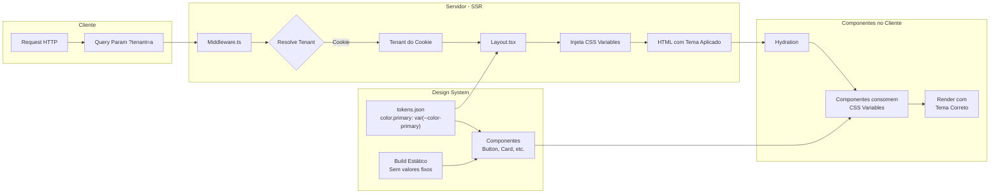

# MFE Whitelabel

Arquitetura de Micro Frontends (MFE) para soluções whitelabel com Design System compartilhado.

> A decisão de usar monorepo neste projeto é uma questão de conveniência para montagem e entrega do desafio proposto. Em um ambiente real, eu sugeriria que cada aplicação e compartilhamento de dados tivesse seu próprio repositório, para compartimentar melhor os domínios entre as equipes.

## Como Rodar
### Pré-requisitos
- Node.js 18+
- pnpm

### Passos
```bash
pnpm install # 1. Instalar dependências
pnpm dev # 2. Iniciar aplicação em desenvolvimento
# 3. Acessar no navegador
# http://localhost:3000
```

### Testar Tenants
```bash
http://localhost:3000?tenant=a # Cliente A (azul)
http://localhost:3000?tenant=b # Cliente B (verde)  
```

## Arquitetura



### Estrutura do Projeto

```
/
├── apps/
│   ├── shell/          # Aplicação principal (host)
│   └── payments-mf/    # Micro frontend de pagamentos
├── packages/
│   └── design-system/  # Design System compartilhado via registry
└── pnpm-workspace.yaml # Configuração do workspace
```

> Usei pnpm workspaces pela simplicidade: permite gerenciar múltiplos pacotes em um único comando (`pnpm install`, `pnpm build`) sem configuração complexa. É mais leve que npm workspaces e mais direto que ferramentas como Lerna ou Nx para esta proposta.

### Aplicações
#### Shell (apps/shell)
- **Framework**: Next.js 14 com App Router
- **Renderização**: Server-Side Rendering (SSR)
- **Responsabilidade**: Orquestrador dos micro frontends

> Usei Next.js 14 por compatibilidade com Module Federation e estabilidade. Versões mais recentes podem ter breaking changes que afetam a implementação atual de micro frontends. 

#### Payments MF (apps/payments-mf)
- **Framework**: React
- **Responsabilidade**: Funcionalidades específicas
- **Autonomia**: Desenvolvimento e deploy independentes

### Design System
- **Pacote**: `@dmontone/design-system`
- **Documentação**: [README do Design System](./packages/design-system/README.md)
- **Componentes**: Button, BarChart
- **Tokens**: Variáveis CSS para white label

> O pacote do Design system está publicado no registry público por questão de conveniência, mas em um ambiente produtivo real ele pode ser registrado em um registry privado para mitigar qualquer tipo de risco de segurança, se for do interesse.

## White Label via SSR

### Como Funciona
1. Middleware extrai tenant (Cookie > Query > Default)
2. Layout injeta variáveis CSS no HTML
3. Componentes usam `var(--color-primary)`

> O uso de query string (`?tenant=a`) serve apenas para atualizar o cookie por conveniência no ambiente de desenvolvimento. Em um ambiente real, o cookie seria montado durante o processo de autenticação ou o valor seria injetado pelo CI em variáveis de ambiente no momento do build, a depender do fluxo de negócio.

### Teste de Tenants
```bash
?tenant=a  # Cliente A (azul)
?tenant=b  # Cliente B (verde)
```

### Configuração de Temas
```typescript
// apps/shell/lib/tenant.ts
const tenantThemes = {
  a: {
    primaryColor: '#0066cc',
    logoPath: '/logos/client-a.svg'
  },
  b: {
    primaryColor: '#00aa44',
    logoPath: '/logos/client-b.svg'
  }
}
```

## Tecnologias
- **Gerenciador de pacotes**: pnpm com workspaces
- **Runtime**: Node.js
- **Framework**: Next.js 14
- **Linguagem**: TypeScript
- **Arquitetura**: Micro Frontends
