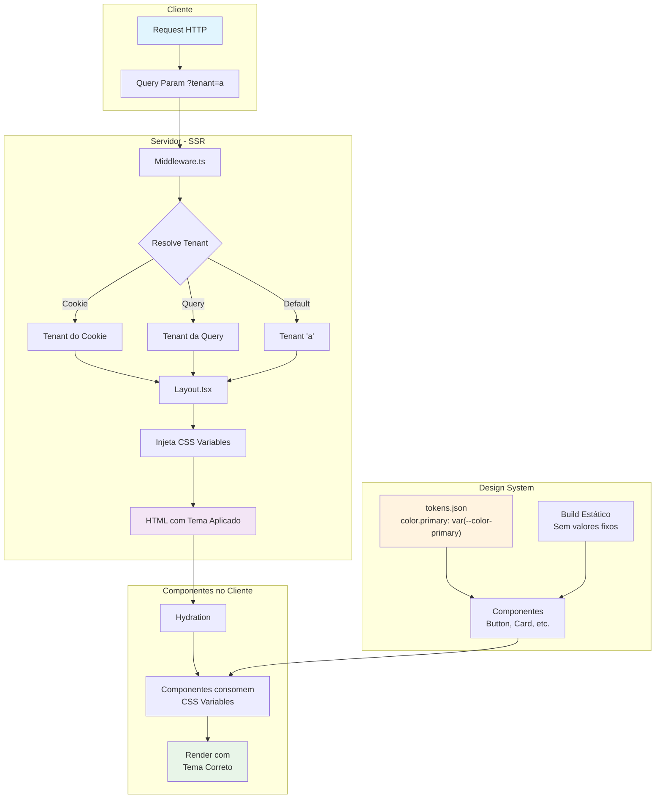

# MFE Whitelabel

Monorepo com arquitetura de Micro Frontends (MFE) para soluções whitelabel, com uso de Design System para consistência visual.

## Visão Arquitetural


### Estrutura do Monorepo

```
/
├── apps/
│   └── shell/          # Aplicação principal (host)
│   └── payments-mf/    # Aplicação remota
├── packages/           # Pacotes compartilhados
└── pnpm-workspace.yaml # Configuração do workspace
```

### Shell (apps/shell)
Aplicação Next.js que serve como container/orquestrador dos micro frontends.
- **Framework**: Next.js 14 com App Router (por compatibilidade com federation)
- **Renderização**: Server-Side Rendering (SSR)

### Tecnologias
- **Gerenciador de pacotes**: pnpm com workspaces
- **Runtime**: Node.js
- **Framework**: Next.js 14
- **Linguagem**: TypeScript

## White Label via SSR

### Estratégia SSR first
A implementação usa SSR para injetar as variáveis de CSS diretamente no HTML antes de enviar ao cliente. Isso garante:
- O tema já está aplicado quando o cliente recebe o HTML
- Não há re-renderização client-side para aplicar o tema
- O HTML já contém o tema correto para indexação

### Uso de CSS Variables
O sistema utiliza CSS Custom Properties para permitir troca de temas:

```css
:root {
  --color-primary: #0066cc; /* Injetado via SSR */
  --logo-path: '/logos/client-a.svg'; /* Injetado via SSR */
  --spacing-md: 1rem; /* Injetado via SSR */
  --radius-md: 8px; /* Injetado via SSR */
}
```

### Simulador de Tenant
Query parameters trocam o tenant no cookie (para testes)  
O cookie tem httpOnly por segurança, ele fica inacessível via cliente/javascript

```bash
?tenant=a
?tenant=b
```

### Configuração de Temas
Os temas são configurados em `apps/shell/lib/tenant.ts`: por motivo de desenvolvimento. Em produção pode ser incluso em API ou recurso externo.

```typescript
const tenantThemes = {
  a: {
    primaryColor: '#0066cc', // Azul para Cliente A
    logoPath: '/logos/client-a.svg'
  },
  b: {
    primaryColor: '#00aa44', // Verde para Cliente B
    logoPath: '/logos/client-b.svg'
  }
}
```

### Fluxo de Resolução

1. `middleware.ts`: Extrai tenant (Cookie > Query > Default) e seta cookie se necessário
2. `layout.tsx`: Lê tenant e injeta variáveis CSS
3. Componentes usam `var(--color-primary)`

## Design System
Isola visual em um pacote compartilhado mínimo, permitindo reuso entre MFEs.

### Estrutura do Design System

```
packages/design-system/
├── tokens.json       # Tokens de design (contrato visual)
├── src/
│   ├── chart/        # Componente Chart
│   ├── button.tsx    # Componente Button
│   └── index.ts      # Exportações
├── package.json      # Configuração do pacote
└── tsconfig.json     # Configuração TypeScript
```

### Tokens como Contrato Visual
Os tokens em `tokens.json` definem o contrato visual do sistema:

```json
{
  "color": { "primary": "var(--color-primary)" },
  "spacing": { "md": "var(--spacing-md, 1rem)" },
  "radius": { "md": "var(--radius-md, 8px)" }
}
```

**Benefícios dos tokens:**
- Valores padronizados em todos os componentes
- Mudança centralizada afeta todos os componentes
- Variáveis de CSS permitem tema sem rebuild


### Consumo
```ts
import { Button } from '@dmontone/design-system'  
<Button>Label</Button>
```
### Fluxo de Consumo e Injeção de Estilos



## Governança do Design System
### Versionamento Semântico Documentado
#### **MAJOR (X.0.0) → Quebra de Contrato**
- **Remoção de tokens**: Tokens existentes são removidos
- **Mudança de nome**: Tokens renomeados sem retrocompatibilidade
- **Mudança de tipo**: Alteração fundamental de estrutura
- **Exemplo**: `color.primary` removido ou renomeado

#### **MINOR (0.X.0) → Novos Tokens**
- **Adição de tokens**: Novos tokens sem afetar existentes
- **Novas categorias**: Expansão do sistema de design
- **Exemplo**: Adicionar `spacing.xs`, `border.radius.sm`

#### **PATCH (0.0.X) → Fixes Internos**
- **Correção de valores**: Ajustes sem quebrar API
- **Documentação**: Melhorias descritivas
- **Performance**: Otimizações internas
- **Exemplo**: Corrigir valor de `color.primary` para melhor contraste

#### Comunicação Ativa**
- **Changelog**: Documentar mudanças em CHANGELOG.md
- **Pull Request**: Alertar sobre deprecação em PRs
- **Slack/Teams**: Comunicar times afetados
- **Documentação**: Guia de migração claro

#### **Período de Transição**
- **Duração**: Mínimo 2 meses para deprecação (período pode ser revisto sob demanda)
- **Suporte**: Ajuda ativa aos times para migração
- **Monitoramento**: Verificar uso de tokens deprecated

#### **Remoção Controlada**
- **Apenas na próxima MAJOR**: Tokens removidos só em versões major

### Exemplo Prático de Evolução
#### **v1.2.0 → v1.3.0 (MINOR)**
```json
{
  "color": {
    "primary": "var(--color-primary)",
    "secondary": "var(--color-secondary)" // NOVO
  }
}
```

#### **v1.3.0 → v1.3.1 (PATCH)**
```json
{
  "spacing": {
    "md": "var(--spacing-md, 1.2rem)" // Alterado de 1rem
  }
}
```

#### **v1.3.1 → v2.0.0 (MAJOR)**
```json
{
  "color": {
    "primary": "var(--color-primary)"
  }
}
```

### Processo de Mudança

#### **1. Proposta**
- Issue descrevendo mudança necessária
- Análise de impacto: componentes/aplicações afetadas
- Avaliação de risco: nível de risco da mudança

#### **2. Decisão**
- Time/comitê de Design System aprova mudança
- Definição da versão (MAJOR/MINOR/PATCH)

#### **3. Implementação**
- Desenvolvimento
- Testes automatizados para garantir compatibilidade

#### **4. Comunicação**
- Release notes detalhadas
- Guia de migração se necessário
- Suporte aos times durante a transição

### Benefícios da Governança
#### **Para Times Consumidores**
- **Previsibilidade**: Mudanças controladas e documentadas
- **Segurança**: Tempo adequado para migração
- **Clareza**: Comunicados claros sobre impactos

#### **Para Time do Design System**
- **Evolução controlada**: Mudanças sem quebras abruptas
- **Rastreabilidade**: Histórico claro de decisões
- **Alinhamento**: Processo padronizado de decisões

#### **Para o Produto**
- **Consistência**: Evolução mantendo coerência visual
- **Qualidade**: Processos que garantem excelência
- **Escalabilidade**: Sistema que cresce de forma sustentável

### Ferramentas de Governança

#### **Versionamento**
- **Semantic Release**: Automatização de versões
- **Conventional Commits**: Padronização de mensagens
- **Changelog**: Geração automática de histórico

#### **Monitoramento**
- **Bundle Analysis**: Verificar uso de tokens
- **Deprecation Warnings**: Alertas em development
- **Usage Analytics**: Estatísticas de adoção

#### **Documentação**
- **Storybook**: Catálogo vivo de componentes
- **Design Tokens**: Documentação de tokens


### Microfrontend payments-mf

App React simples e independente desenvolvido por outro time:

- **Isolamento**: Pasta própria com package.json independente
- **Contrato**: Exporta `<PaymentsApp />` com interface definida
- **Auto-suficiente**: Contém sua própria lógica e UI

#### Contrato Mínimo
O microfrontend define um contrato claro de comunicação:

```typescript
export interface PaymentsProps {
  tenant: string  // Dado explícito do Shell
}

export function PaymentsApp({ tenant }: PaymentsProps) {
  // Implementação independente do time responsável
}
```

**Benefícios do contrato explícito:**
- Acoplamento mínimo: Shell passa apenas dados necessários
- Independência: MF pode evoluir sem afetar Shell
- Testabilidade: Interface clara facilita testes

### Importação Dinâmica no Shell
O Shell importa o microfrontend dinamicamente para carregamento sob demanda:

```typescript
const PaymentsApp = dynamic(
  () => import('payments-mf').then(mod => ({ default: mod.PaymentsApp })),
  { ssr: true }  // Server-side only
)

export default function Home() {
  const tenant = 'tenant-a'
  
  return (
    <div>
      {/* ... */}
      <PaymentsApp tenant={tenant} />
      {/* ... */}
    </div>
  )
}
```

**Vantagens do dynamic import:**
- Lazy loading: Carrega apenas quando necessário
- Isolamento: Erros no MF não afetam o Shell
- Performance: Reduz bundle inicial do Shell

### Isolamento por Times

Cada time tem autonomia completa sobre seu microfrontend:

#### Time de Shell (Orquestração)
- Responsabilidade: Layout, routing, estado global
- Controle: Define tenants e gerencia microfrontends
- Evolução: Pode adicionar/remover MFs sem afetá-los

#### Time de Pagamentos (e outras possíveis features)
- Responsabilidade: Lógica de pagamentos, UI específica
- Autonomia: Desenvolvimento, testes e deploy independentes
- Evolução: Pode atualizar seu MF sem afetar outros

### Publicação de Versões
Times publicam versões dos seus microfrontends:

```json
{
  "name": "payments-mf",
  "version": "2.1.0",
  "main": "dist/index.js",
  "types": "dist/index.d.ts"
}
```

**Fluxo de publicação:**
1. **Desenvolvimento**: Time desenvolve em seu workspace
2. **Testes**: Validação isolada do microfrontend
3. **Versão**: Incremento versionamento SemVer
4. **Publicação**: Disponibilização para outros times
5. **Consumo**: Shell atualiza dependência quando desejar

### Contratos Evitam Acoplamento
#### Sem Contrato (Problema)
```typescript
<PaymentsMF 
  user={user}
  config={config}
  onPayment={handlePayment}
  theme={theme}
  // ... muitas dependências implícitas
/>
```

#### Com Contrato (Solução)
```typescript
<PaymentsApp tenant={tenant} />
```

**Benefícios:**
- Manutenibilidade: Mudanças internas não afetam consumidores
- Flexibilidade: MF pode refatorar internamente
- Clareza: Interface explícita documenta dependências

## Comandos

### Desenvolvimento
```bash
pnpm install # Instalar dependências
pnpm dev # Iniciar aplicação shell em modo desenvolvimento
```

### Build
```bash
pnpm build # Build da aplicação shell
pnpm start # Iniciar produção
```
